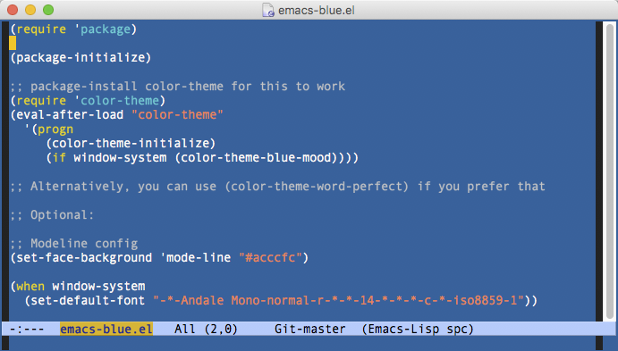
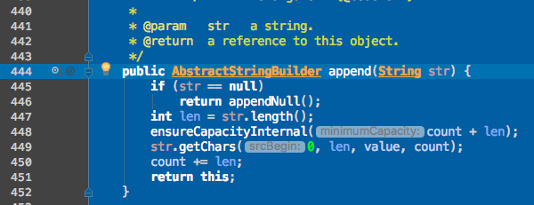
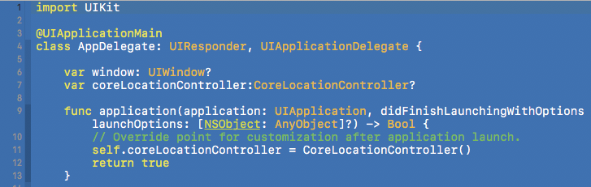
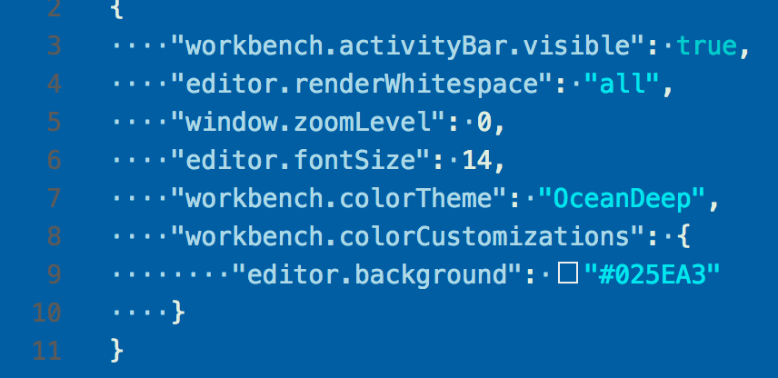

# Editor Themes With Blue Background #

This is a collection of editor/IDE themes or settings that have blue backgrounds in the code editing area.

Blue backgrounds work well on:

* **matte** and **glossy** displays (you don't see your reflection on glossy displays like you do with dark backgrounds)
* **dark** and **light** editor/IDE themes
* with **color temperature shifting** enabled via [f.lux](https://justgetflux.com/) or Apple's [Night Shift](https://support.apple.com/en-us/HT207513)
* Day and night.  It's not too bright and it's not too dark.

And if you loved Word Perfect 5.1 for DOS and/or the various DOS IDE/editors back in the day, you'll appreciate it.

## Emacs ##

This uses [Blue Mood theme](https://github.com/emacs-jp/replace-colorthemes/blob/master/blue-mood-theme.el)

## IntelliJ IDEA and other JetBrains IDEs ##

* This will work in all JetBrains IDEs, though may need additional tweaks for some languages.

## XCode ##

## Visual Studio Code ##

My configuration only sets the background color, and uses a theme on top of this.  I found [OceanDeep](https://marketplace.visualstudio.com/items?itemName=pierrenel.theme-oceandeep) to work well with this, but it's worth trying other themes.

[VS Code 1.12](https://code.visualstudio.com/updates/v1_12) finalized the color settings official and they are now non-experimental (the settings are different than 1.11 and I have updated to reflect this).  There is also a new [theme generator](https://github.com/Tyriar/vscode-theme-generator) that I have not tried out yet.
